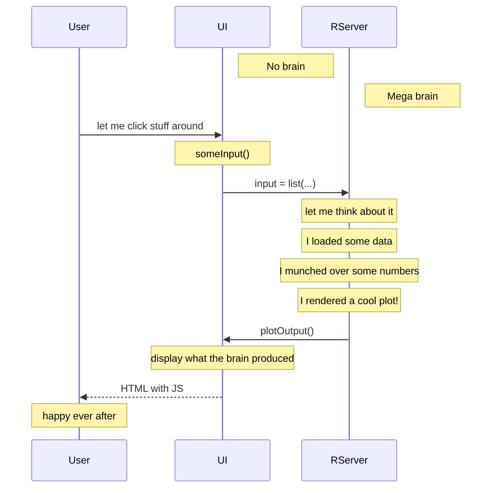

## How shiny works

```mermaid
sequenceDiagram
%% actors
  participant User as User
  participant UI as UI
  participant RServer as RServer
%% sequence of unfortunate events
  Note right of UI: No brain
  Note right of RServer: Mega brain
  User ->> UI: let me click stuff around
  Note over UI: someInput()
  UI ->> RServer: input = list(...)
  Note over RServer: let me think about it
  Note over RServer: I loaded some data
  Note over RServer: I munched over some numbers
  Note over RServer: I rendered a cool plot!
  RServer ->> UI: plotOutput()
  Note over UI: display what the brain produced
  UI -->> User: HTML with JS
  Note over User: happy ever after
%% end of it  
```

