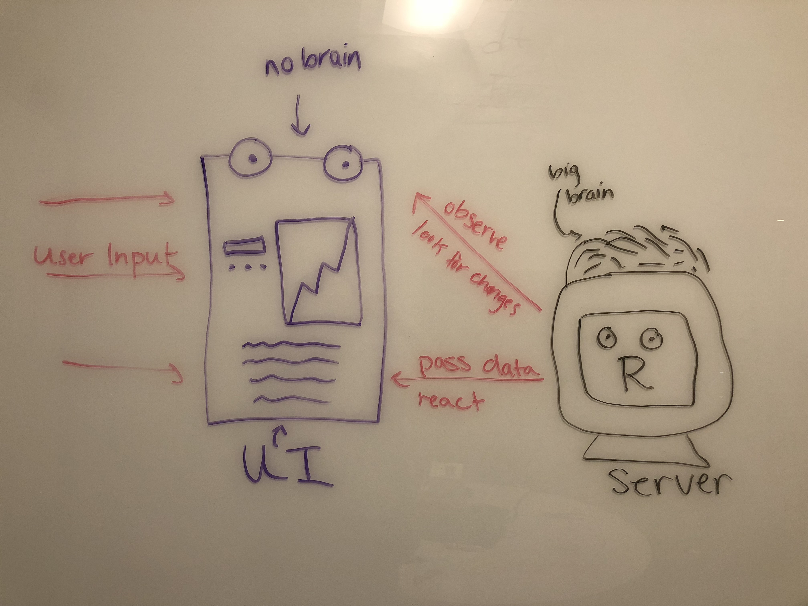

## Installing Shiny

In RStudio, run

```{r, eval = FALSE} 
install.packages("shiny")
install.packages("shinythemes")
```

Then navigate to **New File > Shiny Web App...** and name the app whatever you like.

Click **Create**.

## Components of a Shiny App

**The User Interface (UI)**

- The visual part of your app (what the user sees and interacts with)

- Renders in a web browser

- Under the hood, the UI is composed of Javascript, HTML, and CSS

- We specify the UI elements using R

**The Server**

- The backend of your app

- Performs computations

- Passes data to the UI

- Written in R code

### How Shiny Works



## The User Interface

### Application Layouts

#### fluidPage() and fluidRow()

- Layout defined by rows and columns of components

- Allows the user to specify components which lie on the same line

- Components scale in realtime to fill available space

- Each row contains 12 columns of equal width

**Example:**

```{r, include=FALSE}
# Define server logic required to draw a histogram
server <- function(input, output) {
   
   output$distPlot <- renderPlot({
      # generate bins based on input$bins from ui.R
      x    <- faithful[, 2] 
      bins <- seq(min(x), max(x), length.out = input$bins + 1)
      
      # draw the histogram with the specified number of bins
      hist(x, breaks = bins, col = 'darkgray', border = 'white')
   })
}
```

```{r}
library(shiny)

# Define UI for application that draws a histogram
ui <- fluidPage(
   
   # Application title
   titlePanel("Old Faithful Geyser Data"),
   
   # Sidebar with a slider input for number of bins 
    fluidRow(
       column(width = 3,
              sliderInput("bins",
                   "Number of bins:",
                   min = 1,
                   max = 50,
                   value = 30)),
       
       column(width = 9,
              plotOutput("distPlot"))
    )
)

# Run the application 
shinyApp(ui = ui, server = server)
```

#### sidebarLayout()

**Example:**

```{r}
# Define UI for application that draws a histogram
ui <- fluidPage(
   
   # Application title
   titlePanel("Old Faithful Geyser Data"),
   
   # Sidebar with a slider input for number of bins 
   sidebarLayout(
      sidebarPanel(
         sliderInput("bins",
                     "Number of bins:",
                     min = 1,
                     max = 50,
                     value = 30)
      ),
      
      # Show a plot of the generated distribution
      mainPanel(
         plotOutput("distPlot")
      )
   )
)

shinyApp(ui, server)
```

#### tabsetPanel()

**Example**

```{r}
# Define UI for application that draws a histogram
ui <- fluidPage(
   
   # Application title
   titlePanel("Old Faithful Geyser Data"),
   
   # Sidebar with a slider input for number of bins 
     tabsetPanel(
      tabPanel("First",
        sidebarLayout(
          sidebarPanel(
            sliderInput("bins",
                        "Number of bins:",
                        min = 1,
                        max = 50,
                        value = 30)
          ),
      
      # Show a plot of the generated distribution
          mainPanel(
             plotOutput("distPlot")
          )
        )
      ),
      tabPanel("Second", "Coming soon")
    )
   )

shinyApp(ui, server)
```

#### navlistPanel()

**Example:**

```{r}
# Define UI for application that draws a histogram
ui <- fluidPage(
   
   # Application title
   titlePanel("Old Faithful Geyser Data"),
   
   # Sidebar with a slider input for number of bins 
     navlistPanel("Menu",
      tabPanel("First",
        sidebarLayout(
          sidebarPanel(
            sliderInput("bins",
                        "Number of bins:",
                        min = 1,
                        max = 50,
                        value = 30)
          ),
      
      # Show a plot of the generated distribution
          mainPanel(
             plotOutput("distPlot")
          )
        )
      ),
      tabPanel("Second", "Coming soon")
    )
   )

shinyApp(ui, server)
```

### HTML Tags

You can easily add HTML to your Shiny apps!

```{r}
tags$h3("This is a header")

tags$code("Some R code")

tags$blockquote("This is a quote")
```

### Widgets

#### Slider

```{r}
# "slider" is the input id
sliderInput("slider",
            "Pick a Number:",
            min = 1,
            max = 50,
            value = 30)
```

#### Action Button

```{r}
# "action" is the input id
actionButton("action", label = "Click Me!")
```

<br/>

#### Radio Buttons

```{r}
# radio is the input id
radioButtons("radio", label = "Choose One of These",
  choices = list("First" = 1, "Second" = 2, "Third" = 3), 
  selected = 1)
```

#### Select Input

```{r}
# select is the input
selectInput("select", label = "Choose One of These",
  choices = list("First" = 1, "Second" = 2, "Third" = 3), 
  selected = 1)
```

### shinyThemes

```{r}
# Define UI for application that draws a histogram
ui <- fluidPage(
   
   shinythemes::themeSelector(),
  
   # Application title
   titlePanel("Old Faithful Geyser Data"),
   
   # Sidebar with a slider input for number of bins 
   sidebarLayout(
      sidebarPanel(
         sliderInput("bins",
                     "Number of bins:",
                     min = 1,
                     max = 50,
                     value = 30)
      ),
      
      # Show a plot of the generated distribution
      mainPanel(
         plotOutput("distPlot")
      )
   )
)

shinyApp(ui, server)
```

```{r}
# Define UI for application that draws a histogram
ui <- fluidPage(
   
   shinythemes::shinytheme("superhero"),
  
   # Application title
   titlePanel("Old Faithful Geyser Data"),
   
   # Sidebar with a slider input for number of bins 
   sidebarLayout(
      sidebarPanel(
         sliderInput("bins",
                     "Number of bins:",
                     min = 1,
                     max = 50,
                     value = 30)
      ),
      
      # Show a plot of the generated distribution
      mainPanel(
         plotOutput("distPlot")
      )
   )
)

shinyApp(ui, server)
```

## Server

### Reactivity

4 rules of reactivity (from RStudio):

1. R expressions update themselves, if you ask
2. Nothing needs to happen instantly
3. The app must do as little as possible
4. Think carrier pigeons, not electricity

### renderPlot

- These are reactive functions (e.g. they detect when their dependencies have changes)
- More about this later
- renderTable is similar, but outputs a table instead of a plot

Lets check out the server function from our previous example:

```{r}
# Define server logic required to draw a histogram
server <- function(input, output) {
   
   output$distPlot <- renderPlot({
      # generate bins based on input$bins from ui.R
      x    <- faithful[, 2] 
      bins <- seq(min(x), max(x), length.out = input$bins + 1)
      
      # draw the histogram with the specified number of bins
      hist(x, breaks = bins, col = 'darkgray', border = 'white')
   })
}

shinyApp(ui, server)
```
